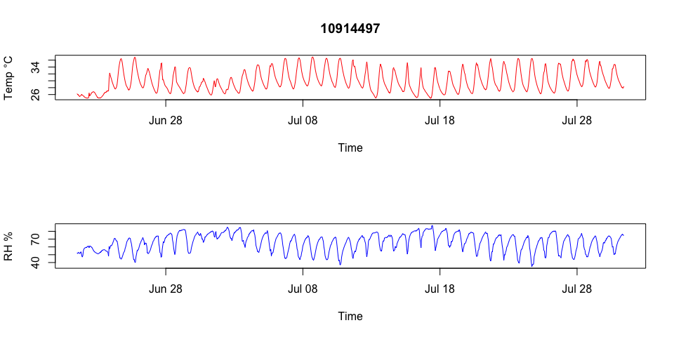

[](https://travis-ci.org/RyanLab/microclimloggers)

`microclimloggers`: Data Wrangling Functions For Microclimate Loggers

An R package to process various microclimate logger data formats. Functions are provided to parse and reshape microclimate logger data (e.g. iButton, iButton Hygrochron, HOBO pendant loggers) that are commonly used in the environmental and biological sciences.

Installation
------------

Install `microclimloggers` from GitHub:

``` r
install.packages("devtools")
devtools::install_github("RyanLab/microclimloggers")
```

Examples
--------

Load `microclimloggers` package:

``` r
library("microclimloggers")
```

Get the path of an example file (HOBO RH Logger)

``` r

hobo_example_path <- system.file("extdata", "HOBO_RH_logger.csv", package = "microclimloggers")
```

Parse the file

``` r
hobo_data <- read_hobo_csv(hobo_example_path)
```

Plot the file

``` r
plot(hobo_data)
```



Meta
----

-   Please [report any issues or bugs](https://github.com/pboesu/microclimloggers/issues).
-   License: GPL-3
-   Get citation information for `microclimloggers` in R doing `citation(package = 'microclimloggers')`

Funding
-------

-   This work was supported by funding from [NSF grant DEB-1641145](https://nsf.gov/awardsearch/showAward?AWD_ID=1641145) and [NSF grant DEB-1518681](https://nsf.gov/awardsearch/showAward?AWD_ID=1518681)
